## Learn to packing with reinforcement learning and shape signature

Author: Yang Shan, Wang Zilu 

From: Department of Management Science and Engineering, Tongji University

The report using English will be updated soon.

## Report(Chinese)

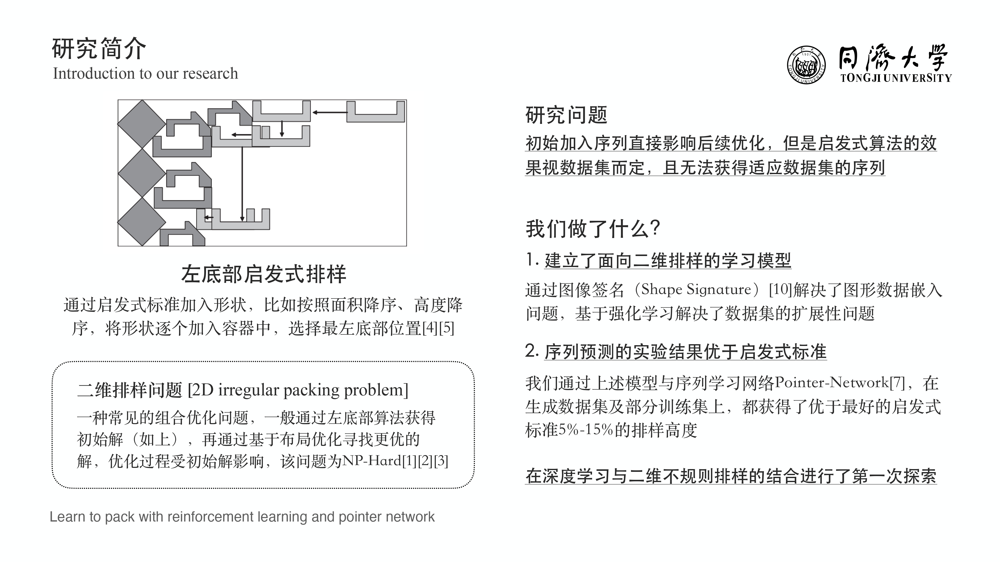

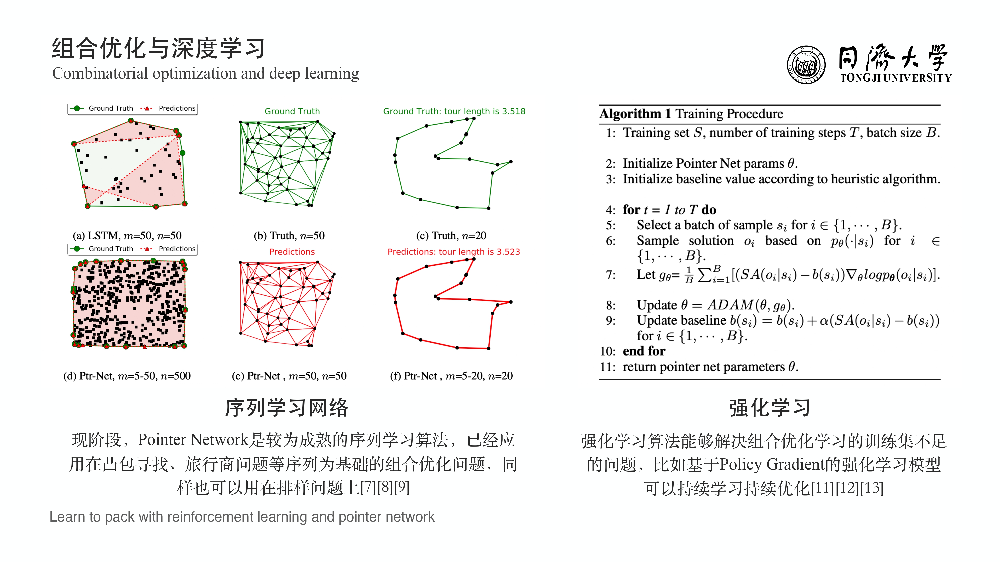

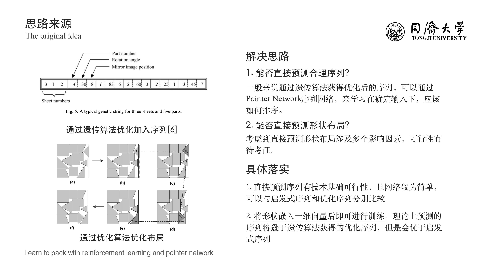

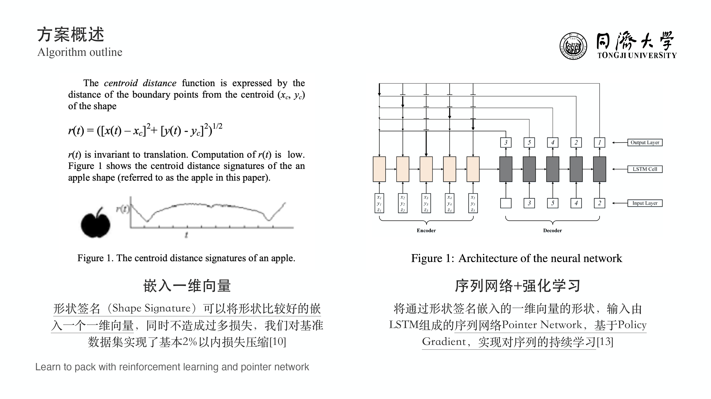

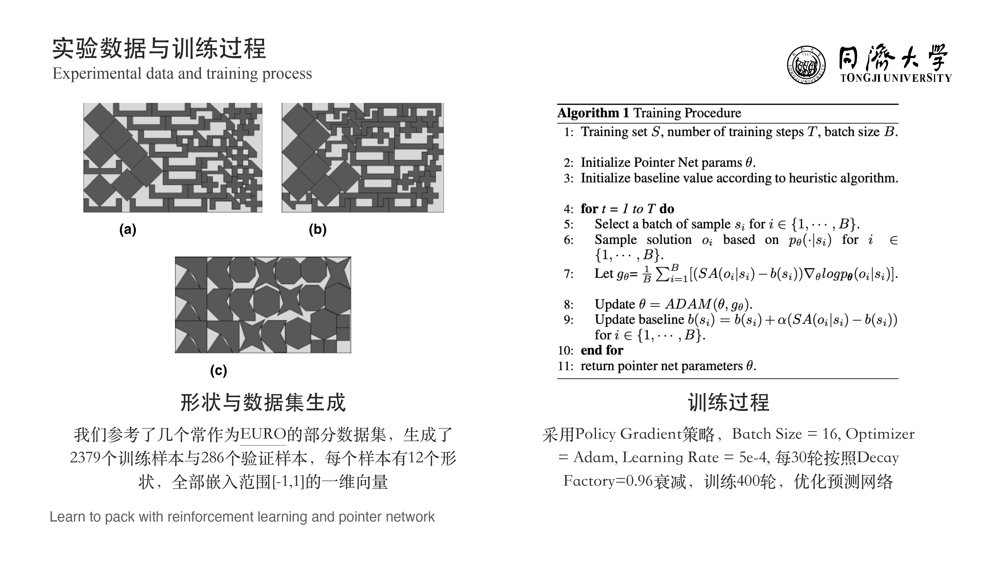

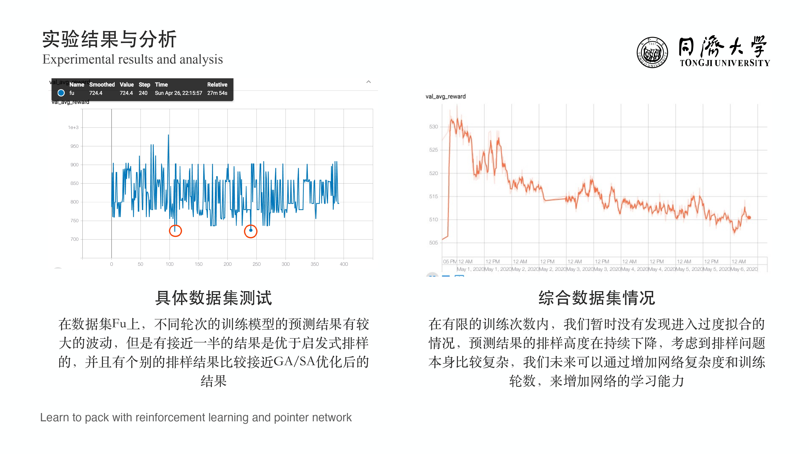

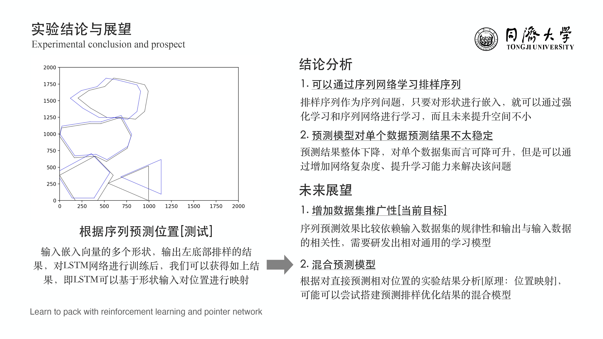

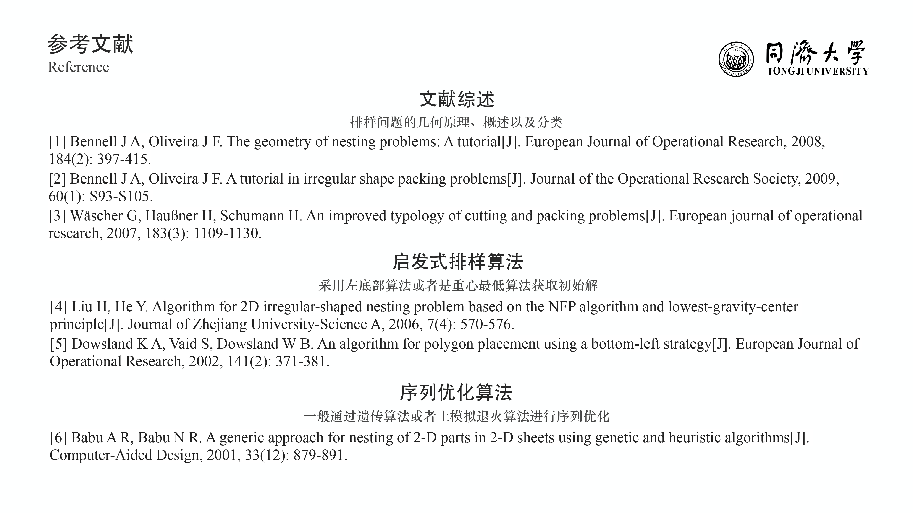

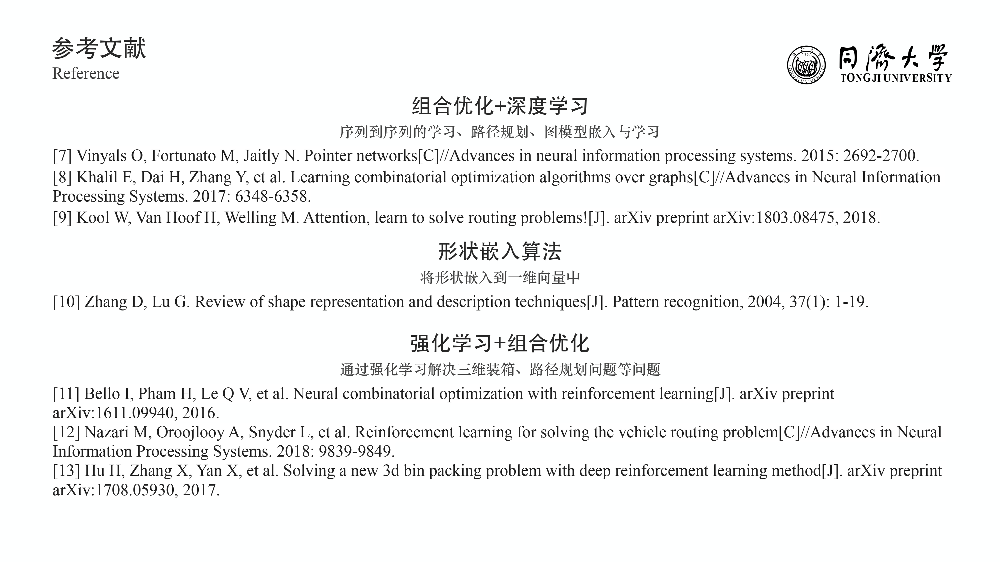

## Introduction

2D irregular packing problem is a kind of cutting and packing problem. It can be classified as  two-dimensional irregular open dimensional problem according to Wascher's paper.

## Architecture of the Network

The architecture of our network mainly consults works by Hu and Bello. 

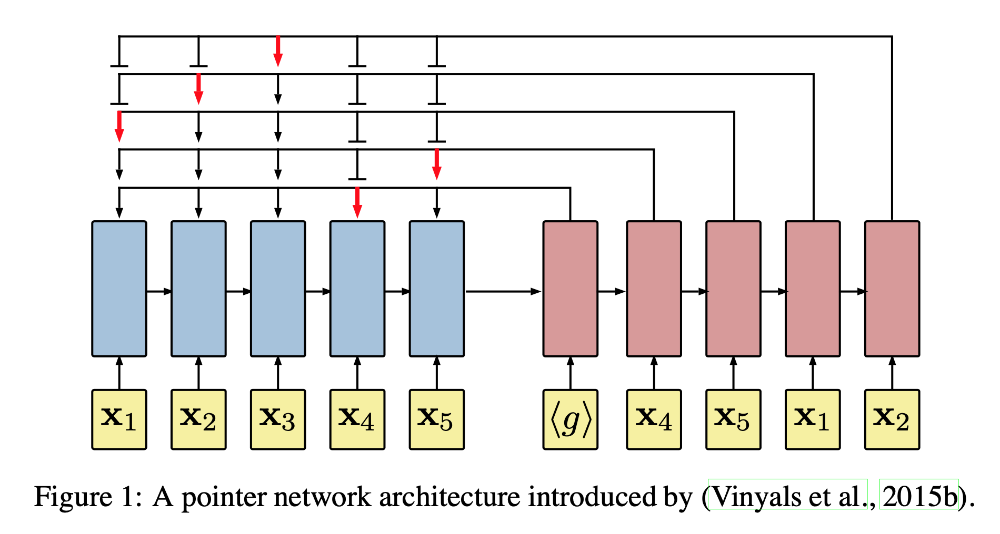

  

## Training Procedure

## Results and What we are doing now?

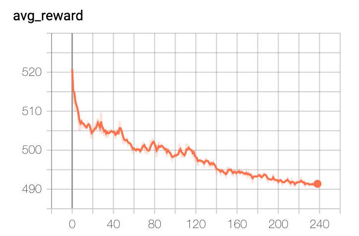

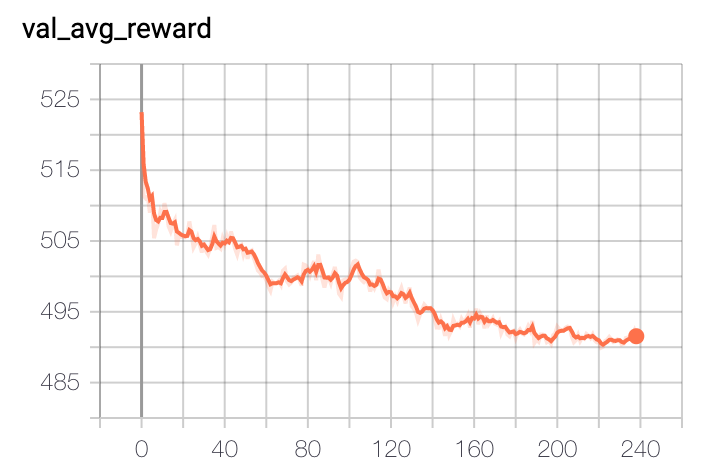

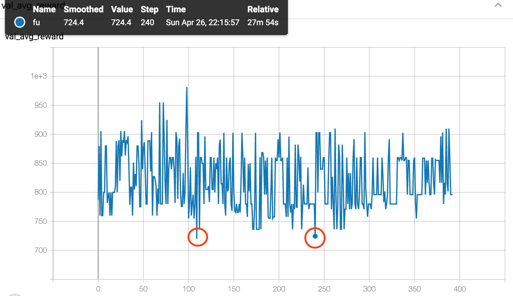

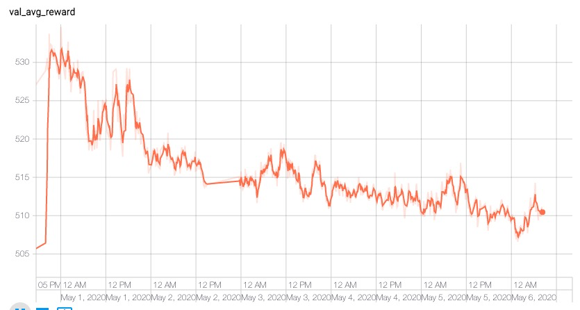

